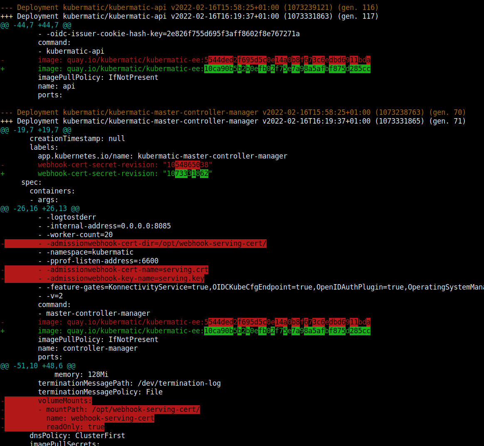

# Stalk - Watch your Kubernetes Resources change

`stalk` is a command line tool to watch a given set of resources and
print the diffs for every change.

<p align="center">
  
</p>

## Installation

You can download a binary for the [latest release on GitHub](https://github.com/xrstf/stalk/releases)
or install stalk via Go:

```bash
go install go.xrstf.de/stalk
```

## Usage

```
Usage of ./stalk:
  -c, --context-lines int       Number of context lines to show in diffs (default 3)
  -w, --diff-by-line            Compare entire lines and do not highlight changes within words
  -h, --hide stringArray        Path expression to hide in output (can be given multiple times)
      --hide-managed            Do not show managed fields (default true)
  -j, --jsonpath string         JSON path expression to transform the output (applied before the --show paths)
      --kubeconfig string       Kubeconfig file to use (uses $KUBECONFIG by default)
  -l, --labels string           Label-selector as an alternative to specifying resource names
  -n, --namespace stringArray   Kubernetes namespace to watch resources in (supports glob expression) (can be given multiple times)
  -s, --show stringArray        Path expression to include in output (can be given multiple times) (applied before the --hide paths)
  -e, --show-empty              Do not hide changes which would produce no diff because of --hide/--show/--jsonpath
  -v, --verbose                 Enable more verbose output
  -V, --version                 Show version info and exit immediately
```

## Examples

```bash
stalk -n kube-system deployments
```

Would watch all Deployments in the `kube-system` namespace. You can give the `-n` flag multiple times
and it even supports glob expressions (e.g. `-n 'kube-*'`).

```bash
stalk -n kube-system deployments,statefulsets,configmaps
```

Would also watch StatefulSets and ConfigMaps. Note that only a single
namespace can be given.

```bash
stalk -n kube-system deployments,statefulsets,configmaps,clusterroles
```

You can include Cluster-wide resources.

```bash
stalk -n kube-system deployments --selector "key=value"
```

A label selector can be given. It will be applied to all given resource kinds.

```bash
stalk -n kube-system deployments kube-apiserver kube-controller-manager kube-scheduler
```

You can also list the resources you are interested in by name. You can give multiple names
and they support glob expressions.

```bash
stalk -n kube-system deployments --hide-managed-fields=false
```

By default `metadata.managedFields` is hidden. You can disable that if
you like.

```bash
stalk -n kube-system deployments --hide spec --hide metadata
```

Show only the `status`. You can combine `--hide` (`-h`) and `--show` (`-s`)
as you like, but show expressions are always applied before hide expressions.

```bash
stalk -n kube-system deployments --show spec --hide spec.labels
```

This should the entire spec, except the labels.

```bash
stalk -n kube-system deployments --jsonpath "{.metadata.name}"
```

JSONPaths are also supported, but only a single one can be given and it's always
applied first (before `--show` and `--hide`). If your JSONPath results in a scalar
value (like `{.metadata.name}`), the `--show` and `--hide` rules are not applied
anymore.

```bash
kubectl get deployments -o yaml --watch | stalk - --jsonpath "{.metadata.name}"
```

If you want, you can also pipe kubectl's output (a series of YAML documents) into
stalk. Note that in this case filtering by label selector or resource name is not
available, but all other formatting options work. You must use a single `-` argument
to indicate reading from stdin.

## License

MIT
